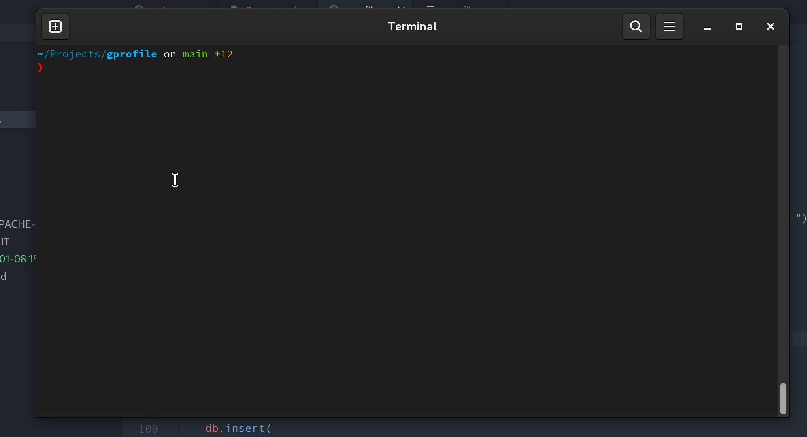

# gprofile [](https://crates.io/crates/gprofile) 

> Quickly switch and manage multiple git profiles.

## Demo

[](./demo.gif)

## Motivation

There are many [similar](https://crates.io/search?q=git%20user) [tools](https://crates.io/search?q=git%20profile) that offer more features and look prettier than this. The main difference between them is this has [zero dependencies](./Cargo.toml) and my focus is on reducing compile times and binary size.

The resulting binary building in `--release` mode is `452K` only (on my machine).

## Installation

If you have rust toolchain installed, you can just do:

```shell
cargo install gprofile
```

Alternatively, you can download pre-build binaries from the [release page](https://github.com/pjmp/gprofile/releases) to you $PATH.

Note: Resulting binary's name is `git-profile`.

## Usage

```shell
# list available profiles
git profile --list

# use `work` profile
git profile --use=work

# delete `work` profile
git profile --delete=work

# edit `personal` profile
git profile --edit=personal
```

## Help

```text
USAGE:
  gprofile [FLAGS]
  gprofile [OPTIONS] <PROFILE>

FLAGS:
  -h, --help            Prints help information
  -v, --version         Prints version information

OPTIONS:
  -c, --create          Create a new profile
  -l, --list            List available profiles
  -d, --delete PROFILE  Delete a given profile
  -e, --edit PROFILE    Edit a given profile
  -u, --use PROFILE     Use profile as current git config.user & config.email
```
